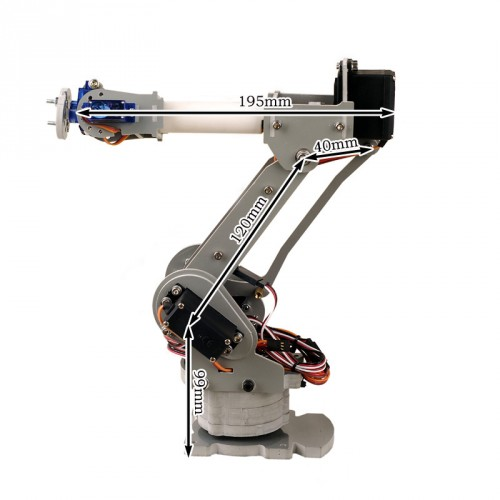
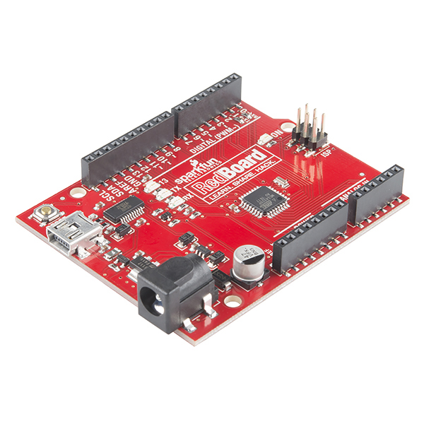
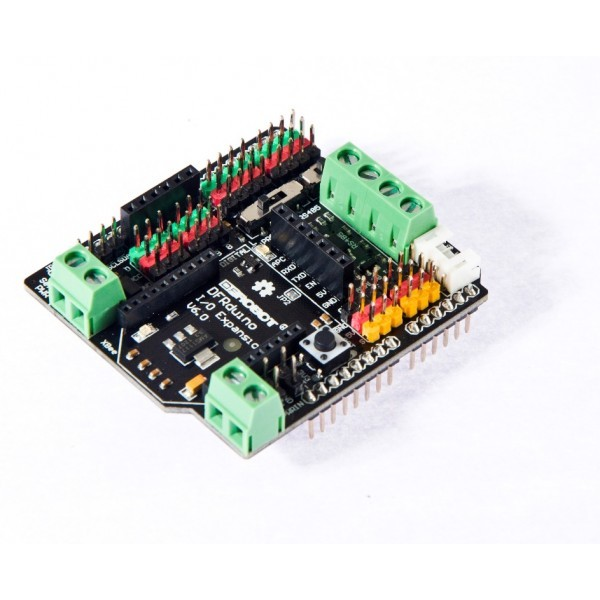
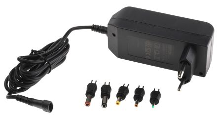
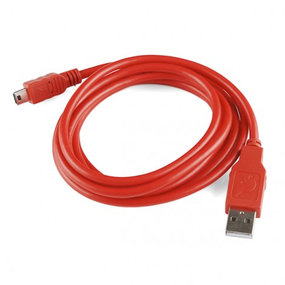
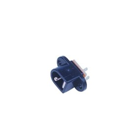
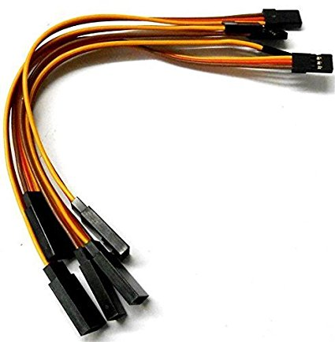

# arduino-sainsmart[](https://circleci.com/gh/wedesoft/arduino-sainsmart)

[Arduino][1] software to steer the SainSmart [DIY 6-axis palletizing robot arm][2] using smooth Bernstein polynomials.

[][vid]

[][2]

[][5]

[][4]

[][6]

[][7]

[][10]

[][17]

## build

Install the dependencies as follows:

```
sudo aptitude install arduino-mk screen google-mock
```

Create the initial calibration file:

```
cp calibration.hh.default calibration.hh
```

Note: You might have to change the *BOARD_TAG* in the *arduino/Makefile*.
See */usr/share/arduino/hardware/arduino/boards.txt* for supported board tags.

Then build the Arduino program using *make*:

```
make
```

## test

You can also build and run the tests on the *PC* using the check target:

```
make check
```

## install on Arduino

The upload target will upload the program via */dev/ttyUSB0* to the *Arduino* board.

```
make upload
```

**Warning: program the board before connecting the servos the first time to prevent erratic motion!**

**Warning: once servos are plugged into the board, always connect the servo power to the DFRobot I/O expansion shield before connecting the USB cable to the Arduino to prevent the board power from stalling!**

## control robot

You can control the robot using the *screen* serial terminal (make sure *ttyUSB0* is the correct port):

```
screen /dev/ttyUSB0 115200
```

Examples of servo commands are:

* **o**: check whether drives are ready to receive more commands (1=ready, 0=busy)
* **t**: get time
* **b**: get base servo angle
* **s**: get shoulder servo angle
* **e**: get elbow servo angle
* **r**: get roll servo angle
* **p**: get pitch servo angle
* **w**: get wrist servo angle
* **B**: get base servo pulse width
* **S**: get shoulder servo pulse width
* **E**: get elbow servo pulse width
* **R**: get roll servo pulse width
* **P**: get pitch servo pulse width
* **W**: get wrist servo pulse width
* **c**: get current configuration (base, shoulder, elbow, roll, pitch, and wrist)
* **l**: get lower limits for servos
* **u**: get upper limits for servos
* **45b**: set base servo angle to 45 degrees
* **-12.5s**: set shoulder servo angle to -12.5 degrees
* **10e**: set elbow servo angle to 10 degrees
* **20r**: set roll servo angle to 20 degrees
* **30p**: set pitch servo angle to 30 degrees
* **40w**: set wrist servo angle to 40 degrees
* **2400B**: set base servo pulse width to 2400
* **1500S**: set shoulder servo pulse width to 1500
* **720E**: set elbow servo pulse width to 720
* **1500R**: set roll servo pulse width to 1500
* **1500P**: set pitch servo pulse width to 1500
* **1500W**: set wrist servo pulse width to 1500
* **1 2 3 4 5 6c**: set configuration (base, shoulder, elbow, roll, pitch, and wrist) to 1, 2, 3, 4, 5, and 6 degrees
* **1 2 3 4 5 6t**: time required to reach the specified configuration
* **ma**: save teach point *a* (there are 12 teach points from *a* to *l*)
* **'a**: go to teach point *a*
* **da**: display configuration of teach point *a*
* **x**: stop all servos (in fact any undefined key should do)

You can exit the *screen* terminal using Ctrl-A \\.

**Warning: self-collisions of the robot can damage the servos!**

# Credits

Thanks to Ian Patient for pointing out the Bernstein polynomials for achieving smooth robot motion.

# External links

* [Sainsmart DIY 6-axis palletizing robot arm][2] (also see [Sainsmart Wiki][11])
* [Sunfounder Standard Gripper Kit Rollpaw for Robotic Arm][15] ([gripper installation instructions][16])
* [Redboard][5] ([Arduino][1] compatible board)
* [DFRobot IO expansion shield for Arduino][4]
* [6V DC/3A power supply][6]
* [2.1 x 5.5mm DC Socket][10]
* [Sparkfun USB Mini-B cable][7]
* [Towerpro MG996R servo][8]
* [Towerpro SG90 9g servo][9]
* [22 AWG RC JR Servo Straight Extension Wire 150mm][17]
* [Arduino multitasking part 1][12], [part 2][13], [part 3][14]

[1]: https://www.arduino.cc/
[2]: http://www.sainsmart.com/diy-6-axis-servos-control-palletizing-robot-arm-model-for-arduino-uno-mega2560.html
[3]: http://7bot.cc/
[4]: https://robosavvy.com/store/dfrobot-io-expansion-shield-for-arduino-v6.html
[5]: https://learn.sparkfun.com/tutorials/redboard-vs-uno
[6]: http://uk.rs-online.com/web/p/plug-in-power-supply/7424762/
[7]: https://robosavvy.com/store/sparkfun-usb-mini-b-cable-6-foot.html
[8]: http://www.hobbyking.com/hobbyking/store/__6221__Towerpro_MG996R_10kg_Servo_10kg_0_20sec_55g.html
[9]: http://www.servodatabase.com/servo/towerpro/sg90
[10]: http://www.maplin.co.uk/p/21-x-55mm-dc-socket-plastic-ft96e
[11]: http://wiki.sainsmart.com/index.php/DIY_6-Axis_Servos_Control_Palletizing_Robot_Arm_Model_for_Arduino_UNO_MEGA2560
[12]: https://learn.adafruit.com/multi-tasking-the-arduino-part-1/
[13]: https://learn.adafruit.com/multi-tasking-the-arduino-part-2/
[14]: https://learn.adafruit.com/multi-tasking-the-arduino-part-3/
[15]: https://www.sunfounder.com/rollpaw.html
[16]: https://www.sunfounder.com/learn/category/Standard-Gripper-Kit-Rollpaw.html
[17]: https://www.amazon.co.uk/d/B00P1716VO
[vid]: https://www.youtube.com/watch?v=_QJ1kuwu9l4
