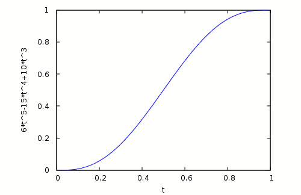
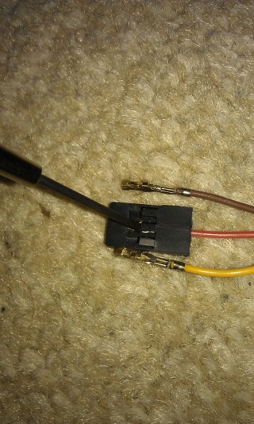
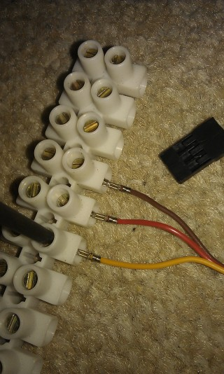
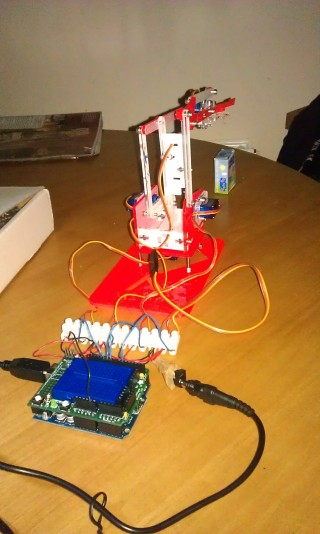

# arduino-mearm [](https://opensource.org/licenses/BSD-2-Clause) [](https://circleci.com/gh/wedesoft/arduino-mearm)

Responsive and smooth servo steering of the Phenoptix [MeArm][1] robot using the [Arduino][2] microcontroller board.

[](http://www.youtube.com/watch?v=bwe8nBm6TN8)

[](etc/polynomial.png)

Note, you might have to [uninstall *brltty* if it conflicts with the Arduino ttyUSB0][3].

## part list

Here is the list of parts I used.

* [MeArm (just the arm)](http://mearm.com/?variant=4765780037) comes with laser cut acrylic sheet, screws, nuts, and Turnigy TG9e servos
* [JR servo straight extension wire 150mm](http://www.amazon.co.uk/gp/product/B00P1716VO) to extend the cable to the gripper servo
* 12 way screw terminal (the servo connectors can be opened and the individual contacts can be put into the screw terminal)
* [Arduino Diecimila](https://www.arduino.cc/en/Main/ArduinoBoardDiecimila) with USB cable
* [2.1 x 5.5mm DC socket](http://www.maplin.co.uk/p/21-x-55mm-dc-socket-plastic-ft96e) (one can solder wires to it and connect them to the screw terminal)
* [6V DC, 30 W power supply with 2.1 x 5.5 plug](http://uk.rs-online.com/web/p/plug-in-power-supply/7424762/), [2.5 A would be enough though](http://mearm.com/collections/mearm/products/mearm-mains-power-supply-6v-2-5a)
* [Adafruit Proto Shield with bread board](https://www.adafruit.com/products/51)
* insulated wire (colours red, black, and other colour)
* a computer

[](etc/jrplug.jpg)

[](etc/screwterminal.jpg)

[](etc/overview.jpg)

## build

Install the dependencies as follows:

```
sudo aptitude install arduino-mk screen google-mock ruby-rspec ruby-serialport ruby-qt4
```

Create the initial calibration file:

```
cp calibration.hh.default calibration.hh
```

Then build the Arduino program using *make*:

```
make
```

## test

You can also build and run the tests on the *PC* using the check target:

```
make check
```

## install on Arduino

The upload target will upload the program via */dev/ttyUSB0* to the *Arduino* board.

```
make upload
```

**Warning: disconnect the servos from the power source while uploading the program to prevent erratic motion!**

## control robot

You can control the robot using the *screen* serial terminal:

```
screen /dev/ttyUSB0 115200
```

Examples of servo commands are:

* **r**: check whether drives are ready to receive more commands (1=ready, 0=busy)
* **t**: get time
* **b**: get base servo angle
* **s**: get shoulder servo angle
* **e**: get elbow servo angle
* **g**: get gripper servo angle
* **B**: get base servo pulse width
* **S**: get shoulder servo pulse width
* **E**: get elbow servo pulse width
* **G**: get gripper servo pulse width
* *c*: get current configuration (base, shoulder, elbow, and gripper)
* *l*: get lower limits for servos
* *u*: get upper limits for servos
* **45b**: set base servo angle to 45 degrees
* **-12.5s**: set shoulder servo angle to -12.5 degrees
* **10e**: set elbow servo angle to 10 degrees
* **30g**: set gripper servo angle to 30 degrees
* **2400B**: set base servo pulse width to 2400
* **1500S**: set shoulder servo pulse width to 1500
* **1500E**: set elbow servo pulse width to 1500
* **544G**: set gripper servo pulse width to 544
* **1 2 3 4c**: set configuration (base, shoulder, elbow, and gripper) to 1, 2, 3, and 4 degrees
* **1 2 3 4t**: time required to reach the specified configuration
* **ma**: save teach point *a* (there are 12 teach points from *a* to *l*)
* **'a**: go to teach point *a*
* **pa**: display configuration of teach point *a*
* **x**: stop all servos (in fact any undefined key should do)

You can exit the *screen* terminal using Ctrl-A \\.

**Warning: self-collisions of the robot can damage the servos!**

**Warning: closing the gripper too far on an object can damage the servo!**

Note that because of the teach points the program is short on memory (1024 bytes on Arduino Diecimila).
Memory corruption can cause self-collisions. However one can test the program without servos being powered.

## file structure

* *.*: control software with tests
* *arduino*: software to upload onto Arduino board
* *etc*: prototype software, math, and simulations

## calibration

You can edit the *calibration.hh* file and update the software on the Arduino.
It is possible to specify the zero position and the resolution of each servo.
Furthermore the limits for each servo can be adjusted in order to avoid self-collisions.
The elbow and shoulder angles are limited against each other.

The zero configuration should look as follows:
* base aligned with platform
* shoulder pointing upward
* elbow horizontal
* gripper tongs at -45 and +45 degree

# Credits

Thanks to Ian Patient for pointing out the Bernstein polynomials for achieving smooth robot motion.

# External Links

* [MeArm][1]
* [Arduino][2] (also see [forum][17])
* [Instructions for MeArm with Arduino][13]
* [Google Test][4]
* [Turnigy TG9e servo][5] ([TG9e servo replacement](http://www.amazon.co.uk/gp/product/B00V3F6LYU))
* [Control the position of a RC servo motor with your Arduino][6]
* [Multi-tasking the Arduino][7]
* [MeArm kinematics][8]
* [MeArm control using potentiometers][10]
* [MeArm inverse kinematics project][9]
* [Robot arm Arduino project for beginners][11]
* [MeArm 0.4 assembly][12]
* [Arduino Servo issues][13]
* [Compiling Arduino sketches using Makefile][16]
* [Arduino - The Documentary][18]
* [Sainsmart DIY 6-axis robotic arm][19]
* [ROS: Robot Operating System][20]
* [Orocos: Open robot control software][21]

[1]: http://mearm.com/
[2]: https://www.arduino.cc/
[3]: http://www.ladyada.net/learn/arduino/lesson0-lin.html
[4]: https://code.google.com/p/googlemock/wiki/ForDummies
[5]: http://www.servodatabase.com/servo/turnigy/tg9e
[6]: https://www.arduino.cc/en/Tutorial/Knob
[7]: https://learn.adafruit.com/multi-tasking-the-arduino-part-1?view=all
[8]: http://bitofahack.com/post/1433701488
[9]: https://github.com/yorkhackspace/meArm
[10]: https://github.com/phenoptix/MeArm
[11]: http://lifehacker.com/build-a-kickass-robot-arm-the-perfect-arduino-project-1700643747
[12]: http://www.mathias-wilhelm.de/arduino/projects/phenoptix-mearm/
[13]: http://mearm.com/pages/instructions
[14]: http://www.double-oops.org/mini-blog/debuggingarduinoservoissues
[15]: http://forum.arduino.cc/index.php?topic=365050.0
[16]: http://hardwarefun.com/tutorials/compiling-arduino-sketches-using-makefile
[17]: http://forum.arduino.cc/
[18]: https://vimeo.com/18539129
[19]: http://www.sainsmart.com/diy-6-axis-servos-control-palletizing-robot-arm-model-for-arduino-uno-mega2560.html
[20]: http://www.ros.org/
[21]: http://www.orocos.org/
